# GPU搭載リモート共用サーバ(Ubuntu)の立ち上げ

この資料はUbuntu22.04 LTSを用いて説明する．  
異なるバージョンを対象とする場合は適宜読み替えること．

## Ubuntuのインストール

### 1. USBインストーラを作成する

[Ubuntu公式サイト](https://jp.ubuntu.com/download)からISOファイルをダウンロードする．  
[Rufus](https://rufus.ie/ja/)を使用してBootable USBを作成する．

注意：Ubuntuで検索すると日本語Remix等がヒットするが，これは使用しないこと．必ず公式からダウンロードすること．

### 2. USBから起動する

ASUS製マザーボードを例に説明する．  
ここの操作はメーカーによって(またはメーカー内でも製品によって)大きく異なるので，必要に応じて読み替えること．

まず，PC起動時に表示されるメーカーロゴの画面下部に表示される指示に従い，UEFI設定画面に移動する.  


Boot Menu(各社表記ゆれあり)よりUEFIモードで用意したBootable USBから起動する．  
つまり，以下の図では`UEFI: Sony Storage Media PMAP, Partition 1 (14808MB)`を選択する．  
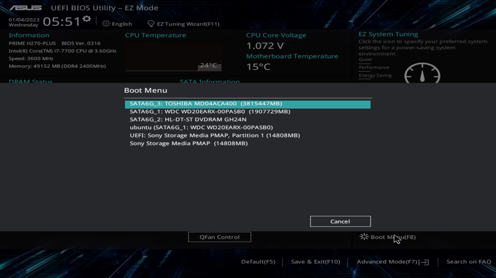

### 3. Ubuntuをインストールする

上記の手順でUSBからUbuntuを起動すると，下のような画面が表示されるので`Try or Install Ubuntu`を選択する．  
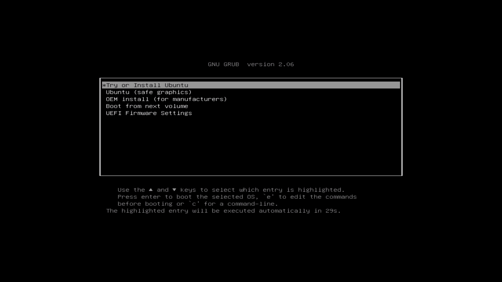

言語として`English`を使用し，`Install Ubuntu`する．
注意：日本語に設定しないこと！  
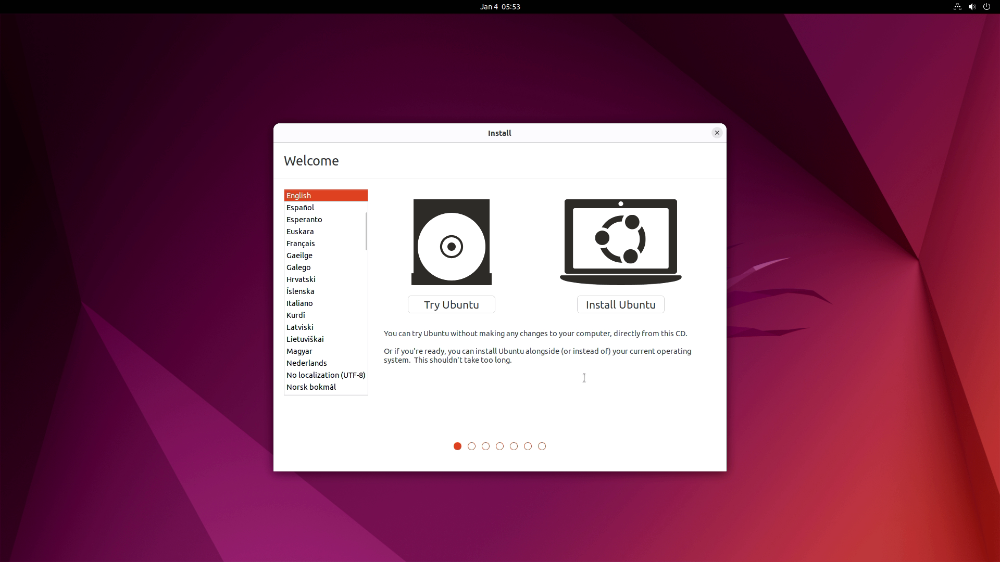

Keyboard layoutは左を`Japanese`，右を`Japanese-Japanese (OADG 109A)`に設定する．(一般的な日本語キーボードを用いる場合)  


Updates and other softwareは`Noraml installation`を選択する．  
`install third-party software for praphics and Wi-Fi hardware and additional media formats`は選択しない．  
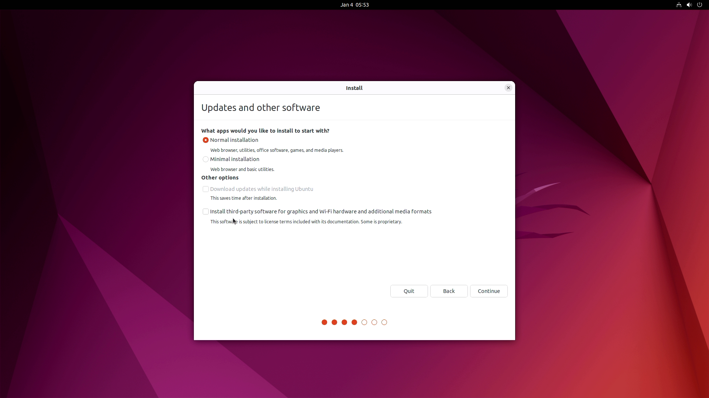

Installation typeでは`Something else`を選択する．  
下の図は元々UbuntuがインストールされていたPCに対して再インストールする場合に表示される画面であるが，他の場合でも同様にする．  
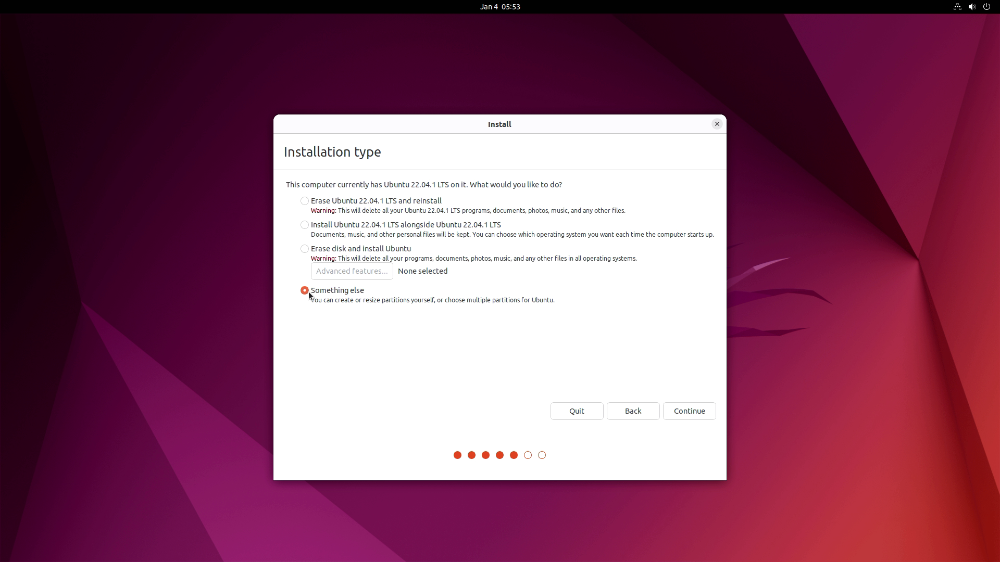

PC内にあるSSDやHDDの数・種類に応じて変わるが，このような画面が表示される．  
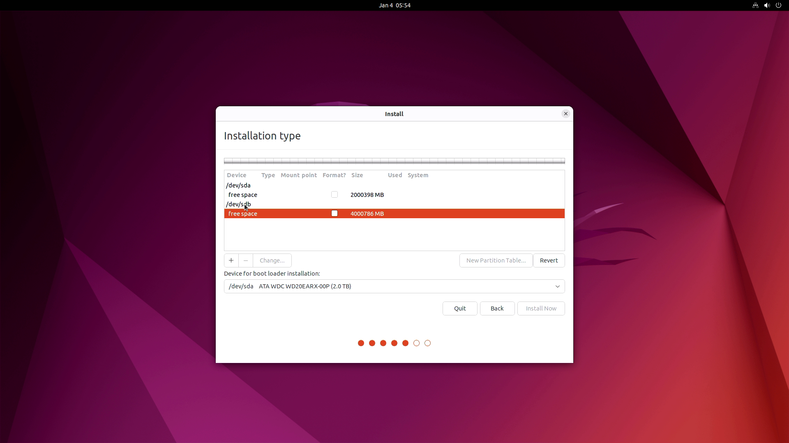

元から何かしらがインストールされている場合は下の図のようになる．  
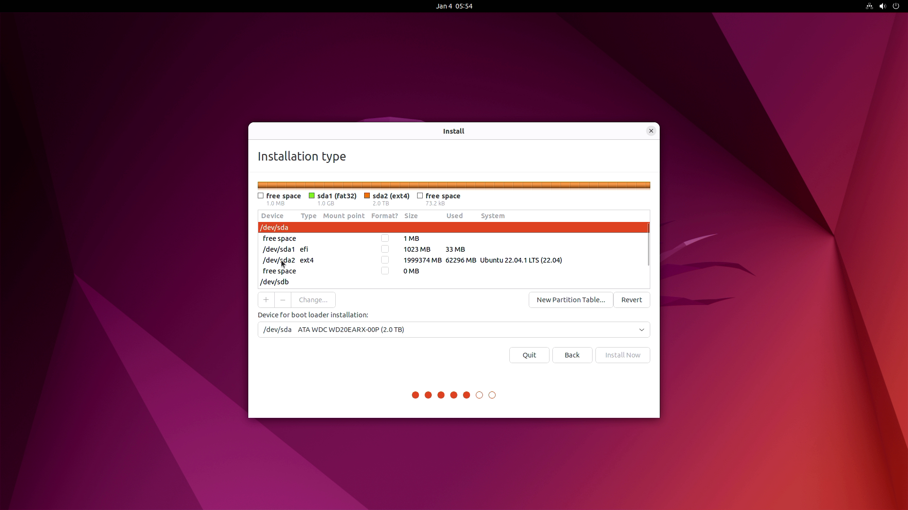

この場合，各領域を選択，右クリックして`Delete`を選択することで削除していく．
元のデータは消えるため注意すること．  
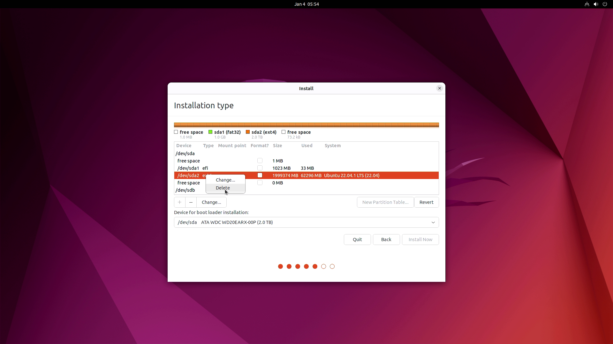

インストール先ディスク(通常は`/dev/sda`)の`free space`と書かれている部分を右クリックし，`Add`をクリックする．
Mount pointとして`/`を選択し，OKを押して元のウィンドウに戻った後，`Install Now`をクリックして次に進む．  
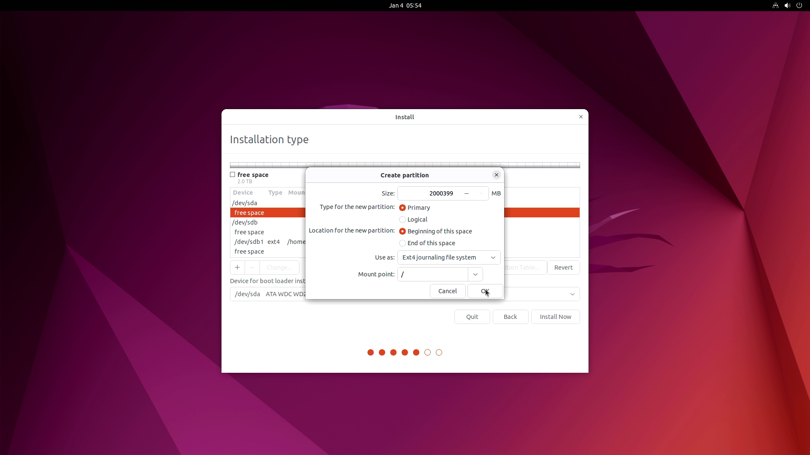

Where are you?では`Tokyo`を選択する．  
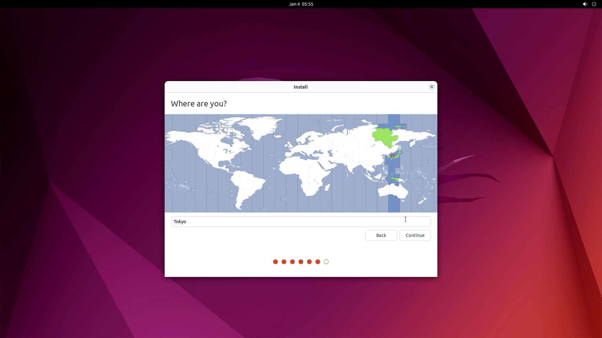

Who are you?では管理者ユーザを作成する．  
管理者ユーザ名とパスワードは管理者か教員に確認すること．  
研究室の運用として，Ubuntuサーバには全て同じユーザを管理者ユーザとして追加することにしている．  
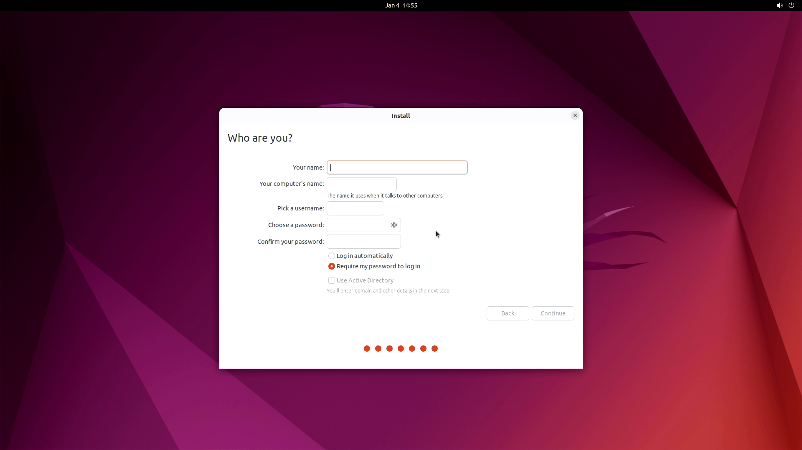

以上でインストール手順は完了である．

### インストール後の初期設定

#### ネットワーク接続
IPアドレスを指定する．  
どのIPを使用するかは管理者か教員の指示を仰ぐこと．

Settingsを開く  
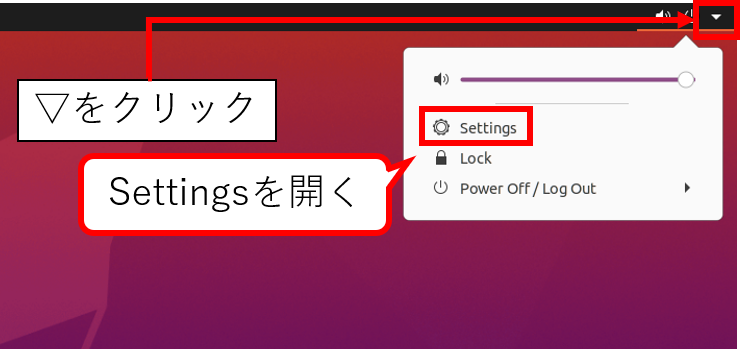

NetworkからIPv4アドレスを設定する  
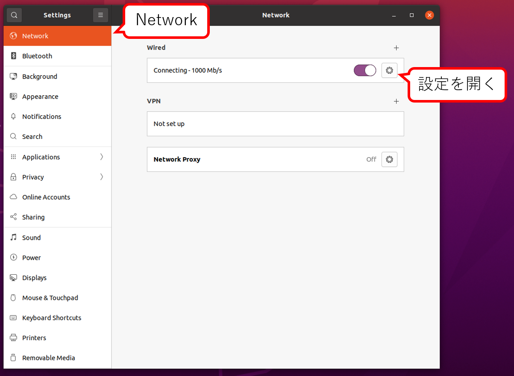

- Address: IPv4アドレス (管理者から指定されたもの, PC毎に異なる 例: 172.xxx.xxx.xxx)
- Netmask: Addressに対応するマスク (研究室に割り当てられたアドレス範囲によって異なる 例: 255.255.xxx.xxx)
- Gateway: Addressに対応するゲートウェイサーバアドレス(研究室に割り当てられたアドレス範囲によって異なる 例: 172.xxx.xxx.254)
- DNS: DNSサーバアドレス (建物によって異なる)

#### 基本ソフトウェアのインストール
ターミナルを起動(`Ctrl+Alt+T`)し，以下のコマンドを入力  
テキストエディタとしてgeditをインストールしているが，好みで変えて良い．  
geditはGUIで起動するので，基本的には直接モニタを接続して使用する．   
使える人はターミナル内でファイルを触れるVimやNano等に慣れておくと良い．

```bash
sudo apt update
sudo apt upgrade
sudo apt install gedit ntp ssh ibus-mozc
# 再起動する
sudo reboot
```

#### 日本語入力の設定

Settings画面のKeyboardからInput SourcesをMozcに設定する(`Japanese` -> `Japanese(Mozc)`)  
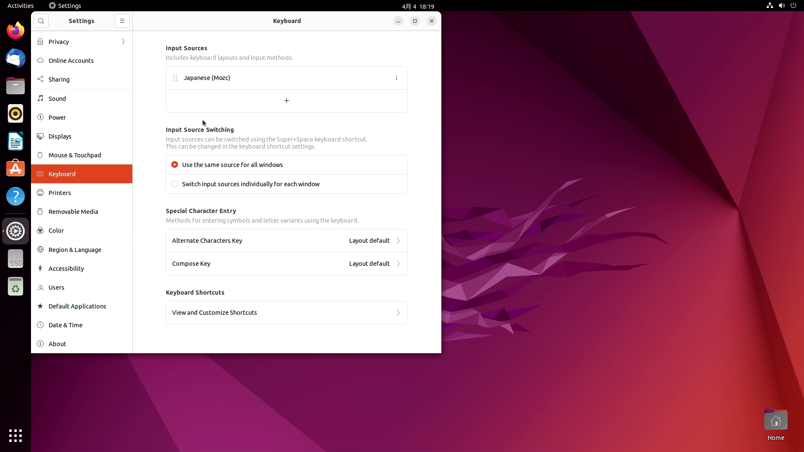

#### NTPサーバの設定

NTP(Network Time Protocol)サーバ: 時刻同期の設定

コンフィグファイルを編集する．  

```bash
sudo gedit /etc/ntp.conf
```

以下のように書き換え  

```
# Use servers from the NTP Pool Project. Approved by Ubuntu Technical Board
# on 2011-02-08 (LP: #104525). See http://www.pool.ntp.org/join.html for
# more information.
# 以下，pool X.ubuntu.~ の行の戦闘に # をつけてコメントアウト
# pool 0.ubuntu.pool.ntp.org iburst
# pool 1.ubuntu.pool.ntp.org iburst
# pool 2.ubuntu.pool.ntp.org iburst
# pool 3.ubuntu.pool.ntp.org iburst
# 立命館大学内のNTPサーバを設定に追加
server ntp.ritsumei.ac.jp iburst
```

```bash
# NTPサービスをリスタート
sudo service ntp restart
# 接続中のNTPサーバを確認
# remote欄に　~.ritsu... が入っていれば良い．
ntpq -p
```

設定完了時の表示例:  
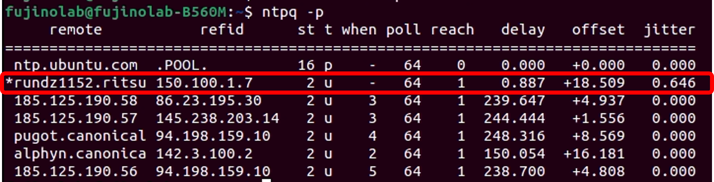  
立命館大学のNTPサーバ(rundz1152.ritsu~)がリストに追加されている．

これ以降，SSHでリモートから接続して設定の続きを行ってもよい．

## Dockerの設定

Dockerの設定手順は半年や1年経つとコマンド類が変わってたりするので，必ず1次情報を参照しながら行うこと！

### Docker/Docker-compose/Nvidia-container-toolkitのインストール

[Nvidia container toolkitのドキュメント](https://docs.nvidia.com/datacenter/cloud-native/container-toolkit/install-guide.html)に従ってインストールを進める．  
更新されている可能性があるため，必要に応じてチェックすること．

以下，手順

#### Dockerを入れる

[公式の手順](https://docs.docker.com/engine/install/)に従ってインストールする
	
手順例 (実際にインストールする場合は，公式をちゃんと参照すること)

```bash
# インストール用シェルスクリプトを取得して実行する
curl https://get.docker.com | sh \
  && sudo systemctl --now enable docker
# インストールされているか確認する
docker --version
```

#### Docker-composeを入れる

[公式の手順](https://docs.docker.com/compose/install/)に従ってインストールを進める

```bash
# インストール手順
sudo curl -L "https://github.com/docker/compose/releases/download/1.29.1/docker-compose-$(uname -s)-$(uname -m)" -o /usr/local/bin/docker-compose
sudo chmod +x /usr/local/bin/docker-compose
sudo ln -s /usr/local/bin/docker-compose /usr/bin/docker-compose
# インストールされているか確認する
docker-compose --version
```

#### Nvidia driverを入れる

ドライバインストール中にSecure boot keyの設定を求められることがある．  
その場合は指示に従ってパスワードを設定し，インストールを完了させてからリスタートする際にBIOSを開いてセキュアブートを無効にする．  
セキュアブートを維持したい場合は，MOK Keyの設定をする．(ややこしいので自分で調べられる人向き)

```bash
# 推奨ドライバを確認する
ubuntu-drivers devices
# vendor	: NVIDIA Corporation
# の下に続くdriver群の中からrecommendedと書かれているものを確認する
# 例: 
# nvidia-driver-470 - distro non-free recommended
# recommendedなドライバをaptからインストールする
sudo apt install nvidia-driver-XXX
# 再起動する
sudo reboot
# インストールされているか確認する．
# GPU一覧が表示されればOK．
nvidia-smi 
```

#### Nvidia-container-toolkitを入れる

[公式の手順](https://docs.nvidia.com/datacenter/cloud-native/container-toolkit/install-guide.html)に従ってインストールを進める

手順例 (バージョンによって変わることがあるので必ず公式手順を確認してから実行すること！)  
```bash
distribution=$(. /etc/os-release;echo $ID$VERSION_ID) \
	&& curl -s -L https://nvidia.github.io/nvidia-docker/gpgkey | sudo apt-key add - \
	&& curl -s -L https://nvidia.github.io/nvidia-docker/$distribution/nvidia-docker.list | sudo tee /etc/apt/sources.list.d/nvidia-docker.list
sudo apt-get update
sudo apt-get install -y nvidia-docker2
sudo systemctl restart docker
# 確認する  
sudo docker run --rm --gpus all nvidia/cuda:11.0-base nvidia-smi
```