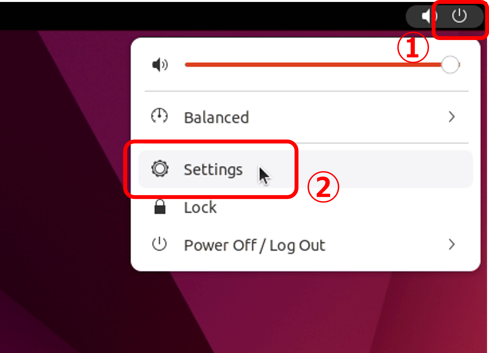

# GPU搭載リモート共用サーバ(Ubuntu)の立ち上げ

## Ubuntuのインストール

### USBからインストール
インストーラを書き込んだUSBをPCに挿し，画面の表示に従ってインストールを進める．

#### 注意事項
- 言語設定は`English`にする．  
(標準のフォルダ構成が日本語だとめんどくさいことになるため．)
- keyboard layoutは`Japanese`の`OADG 109A`を選択．


### インストール後の(最小限の)初期設定

#### ネットワーク接続
IPアドレスを指定する．  
[Fujinowiki](172.24.162.200)を参照して，空いているIPアドレスから適当なものを選択する．  
サーバ用アドレス空間(`172.24.162.200-214`)を優先して割り当てること．  
割当て後は[Fujinowiki](172.24.162.200)を必ず更新すること！

Settingsを開く


Networkを開く


IPv4アドレスを設定する


- 記入例
	- IP: 172.24.162.xxx
	- Mask: 255.255.255.128
	- Default GW: 172.24.162.254
	- DNS: 172.24.32.1, 172.26.100.1

#### 基本ソフトウェアのインストール
ターミナルを起動(`Ctrl+Alt+T`)し，以下のコマンドを入力  
テキストエディタとしてgeditをインストールしている．  
geditはGUIで起動するので，基本的には直接モニタを接続して使用する，  

```bash
sudo apt update
sudo apt upgrade
sudo apt install gedit ntp ssh ibus-mozc
# 再起動する
sudo reboot
```

#### 日本語入力の設定

Settings画面のRegion & Languageから  


Input Sourcesの下の`+`マークをクリックして`Japanese` -> `Japanese(Mozc)`を選択  


`Japanese(OADG 109A)`を横のゴミ箱ボタンで削除する．  


#### NTPサーバの設定

NTP(Network Time Protocol)サーバ: 時刻同期の設定

コンフィグファイルを編集する．  

```bash
sudo gedit /etc/ntp.conf
```

以下のように書き換え  

```
# Use servers from the NTP Pool Project. Approved by Ubuntu Technical Board
# on 2011-02-08 (LP: #104525). See http://www.pool.ntp.org/join.html for
# more information.
# 以下，pool X.ubuntu.~ の行の戦闘に # をつけてコメントアウト
#pool 0.ubuntu.pool.ntp.org iburst
#pool 1.ubuntu.pool.ntp.org iburst
#pool 2.ubuntu.pool.ntp.org iburst
#pool 3.ubuntu.pool.ntp.org iburst
# 立命館大学内のNTPサーバを設定に追加
server ntp.ritsumei.ac.jp iburst
```

```bash
# NTPサービスをリスタート
sudo service ntp restart
# 接続中のNTPサーバを確認
# remote欄に　~.ritsu... が入っていれば良い．
ntpq -p
```

時刻同期以降，SSHでリモートから接続して設定の続きを行ってもよい．

## Dockerの設定

### Docker/Docker-compose/Nvidia-container-toolkitのインストール

[Nvidia container toolkitのドキュメント](https://docs.nvidia.com/datacenter/cloud-native/container-toolkit/install-guide.html)に従ってインストールを進める．  
更新されている可能性があるため，必要に応じてチェックすること．

以下，手順

#### Dockerを入れる

[公式の手順](https://docs.docker.com/engine/install/)に従ってインストールする
	
手順例 (実際にインストールする場合は，公式をちゃんと参照すること)

```bash
# インストール用シェルスクリプトを取得して実行する
curl https://get.docker.com | sh \
  && sudo systemctl --now enable docker
# インストールされているか確認する
docker --version
```

#### Docker-composeを入れる

[公式の手順](https://docs.docker.com/compose/install/)に従ってインストールを進める

```bash
# インストール手順
sudo curl -L "https://github.com/docker/compose/releases/download/1.29.1/docker-compose-$(uname -s)-$(uname -m)" -o /usr/local/bin/docker-compose
sudo chmod +x /usr/local/bin/docker-compose
sudo ln -s /usr/local/bin/docker-compose /usr/bin/docker-compose
# インストールされているか確認する
docker-compose --version
```

#### Nvidia driverを入れる

ドライバインストール中にSecure boot keyの設定を求められることがある．  
その場合は指示に従ってパスワードを設定し，インストールを完了させてからリスタートする際にBIOSを開いてセキュアブートを無効にする．  
セキュアブートを維持したい場合は，MOK Keyの設定をする．(ややこしいので自分で調べられる人向き)

```bash
# 推奨ドライバを確認する
ubuntu-drivers devices
# vendor	: NVIDIA Corporation
# の下に続くdriver群の中からrecommendedと書かれているものを確認する
# 例: 
# nvidia-driver-470 - distro non-free recommended
# recommendedなドライバをaptからインストールする
sudo apt install nvidia-driver-470
# 再起動する
sudo reboot
# インストールされているか確認する．
# GPU一覧が表示されればOK．
nvidia-smi 
```

#### Nvidia-container-toolkitを入れる

[公式の手順](https://docs.nvidia.com/datacenter/cloud-native/container-toolkit/install-guide.html)に従ってインストールを進める

手順例  
```bash
distribution=$(. /etc/os-release;echo $ID$VERSION_ID) \
	&& curl -s -L https://nvidia.github.io/nvidia-docker/gpgkey | sudo apt-key add - \
	&& curl -s -L https://nvidia.github.io/nvidia-docker/$distribution/nvidia-docker.list | sudo tee /etc/apt/sources.list.d/nvidia-docker.list
sudo apt-get update
sudo apt-get install -y nvidia-docker2
sudo systemctl restart docker
# 確認する  
sudo docker run --rm --gpus all nvidia/cuda:11.0-base nvidia-smi
```