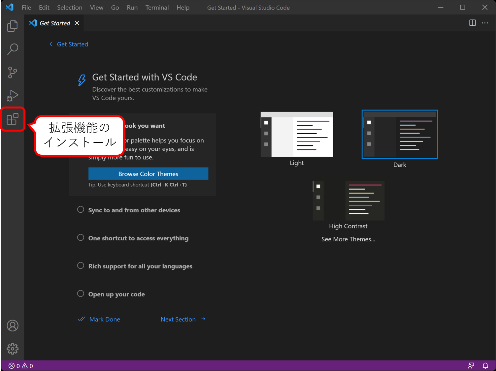
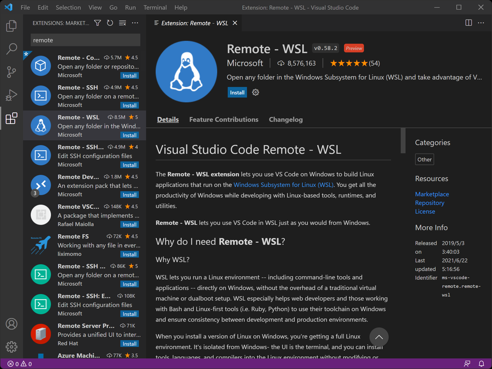
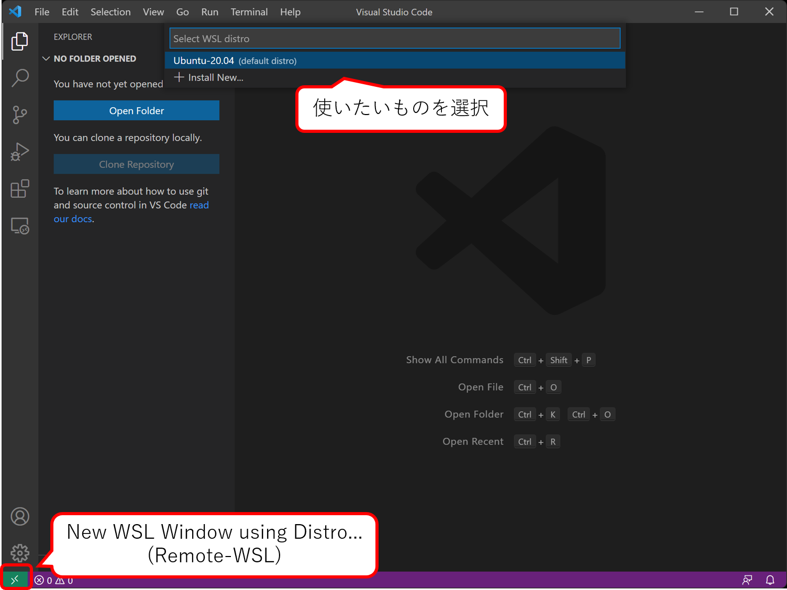
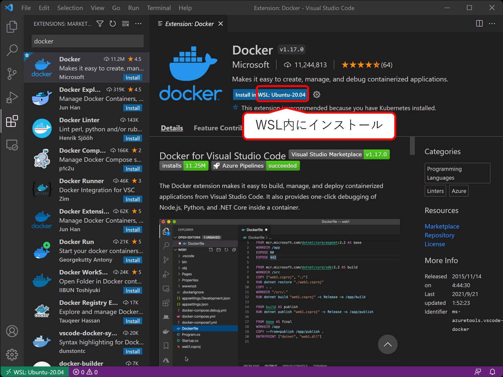
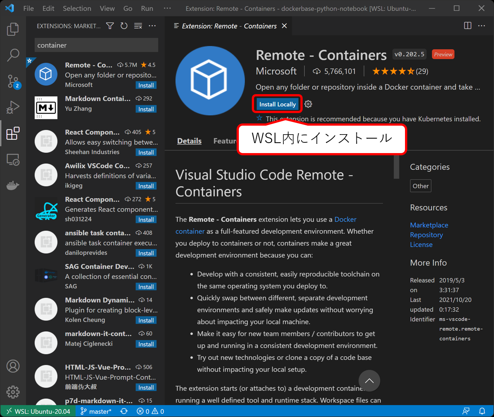
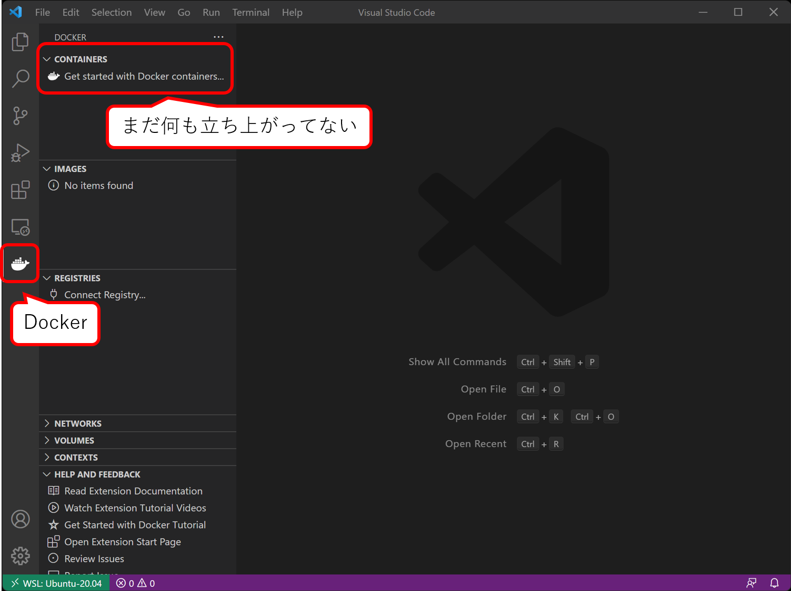
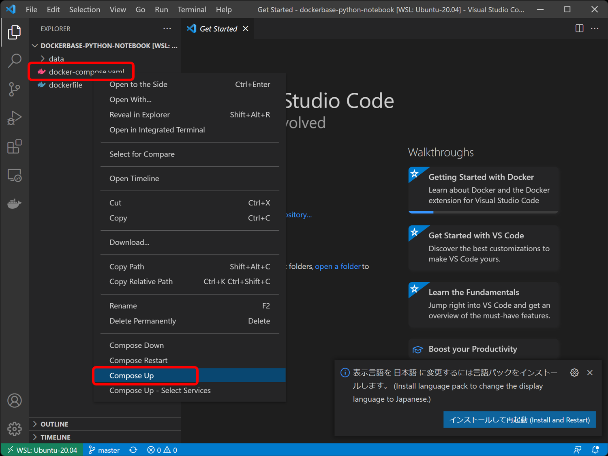
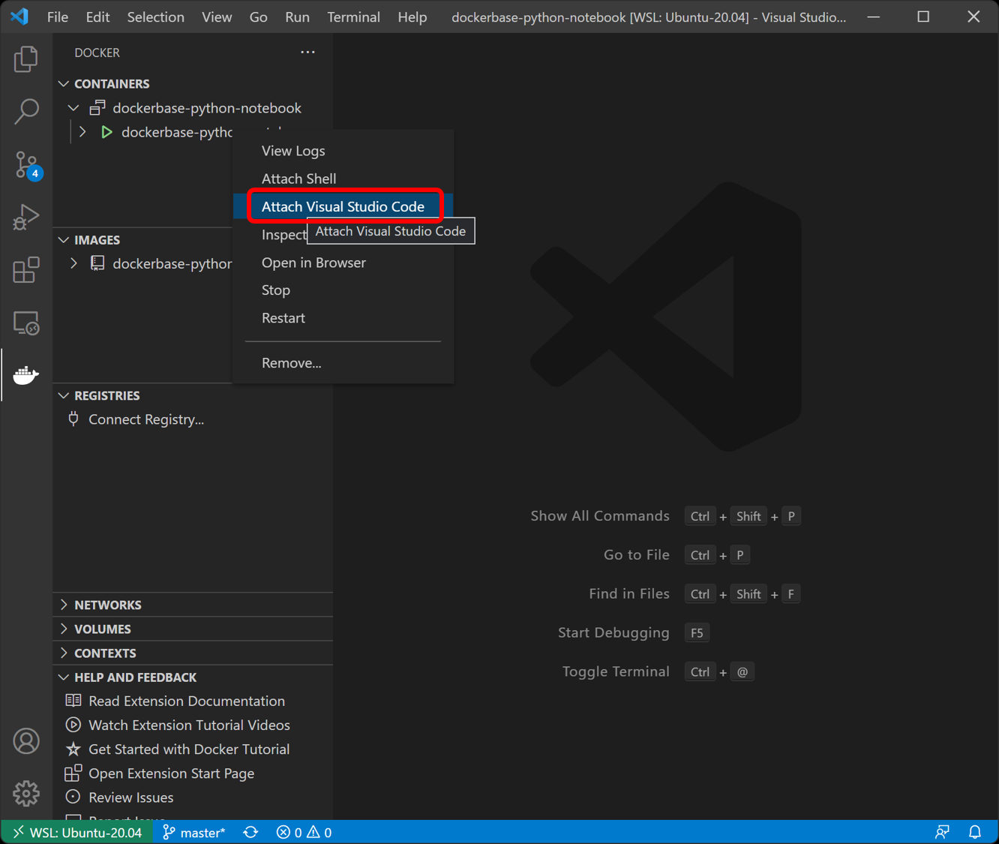

# VSCodeでWSLのDockerコンテナに接続する

VSCodeの拡張機能`Remote -WSL`をインストールする．

左下の緑のアイコンをクリックし，`New WSL Window using Distro...`から接続先のWSLイメージを選択．

左下の緑のアイコンが接続先のWSLイメージを指していることを確認し，WSLへの接続完了．

Terminalを開くとWSLのbashに接続できるし，フォルダ等もWSLイメージ内のVSCodeのようにアクセスできる．

接続先のWSL内に拡張機能`Docker`, `Remote -Containers`をインストールする．

インストールが完了すると左側にDockerアイコンが出現する．

このアイコンをクリックすることでコンテナの管理画面を開くことができる．

試しに適当なDockerコンテナを立ち上げてみる．

例で使用しているのはPython/Jupyter Notebookのコンテナ．

該当のフォルダを開き，`docker-compose.yaml`を右クリックして`Compose UP`を選択．

もちろん，ターミナル等からDockerコマンドを叩いても良い．

Docker管理画面を確認すると，起動中のコンテナ一覧を確認できる．

先程立ち上げたコンテナを右クリックし，`Attach Visual Studio Code`を選択．

WSLと同様に，新しいウィンドウでコンテナに接続したVSCodeが立ち上がる．

