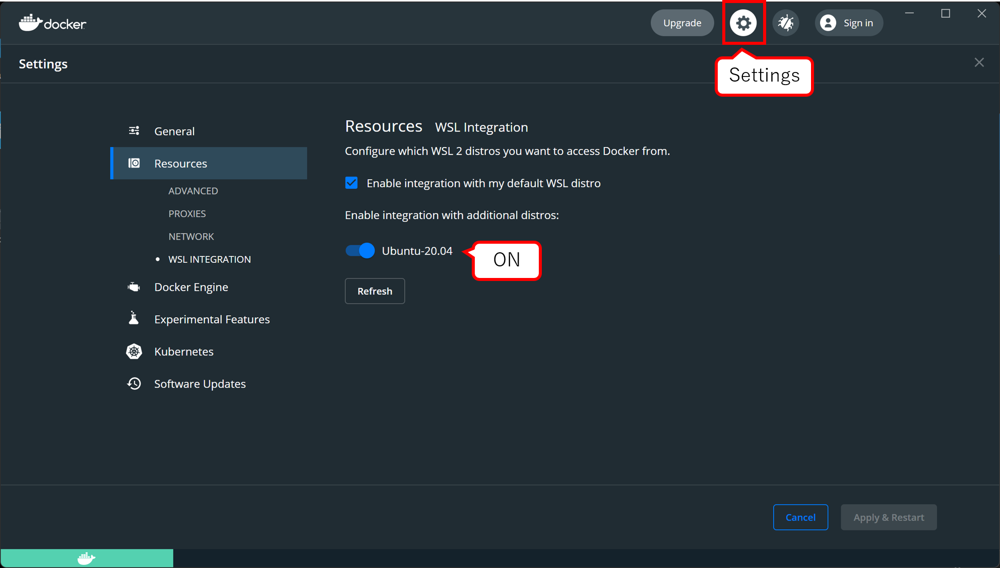

# Docker for Windowsのインストール

## Docker for Windowsのインストール

最新の手順は公式ドキュメントの[Install Dcoker Desktop for Windows](https://docs.docker.com/desktop/windows/install/)を参照のこと．

[公式サイト](https://www.docker.com/get-started)よりDocker for Windowsのインストーラをダウンロードする．

インストーラを起動し，指示に従ってインストールを進める．

DockerはBackendとしてHyper-VとWSLをサポートしているが，パフォーマンスの観点から公式はWSL2 backendの使用を推奨している．

WSL2をインストールするには[WSLをインストール](./wsl.md)を参照．

## WSL2上でDockerを使用する

任意のWSL DistributionをMicrosoft storeからインストールする．

ここでは，Ubuntu20.04 LTSをインストールした例を示す．

Dockerの`Settings`->`Resources`->`WSL INTEGRATION`より，インストールしたDistributionのチェックを入れる．

これにより，該当のDistribution上でDockerコマンドを実行することが可能になる．

## Dockerコンテナのリソース使用量について

Dockerコンテナが使用する計算リソース(CPU/メモリ)等を制限する場合，Hyper-V backendでは`Resources`->`ADVANCED`からリソースの制限をかけることができるが，WSL backendではDocker側から設定をすることはできない．

そこで，WSL自体が使用可能なリソースを制限することになる．

この設定は`wslconfig`ファイルを編集することで行う．